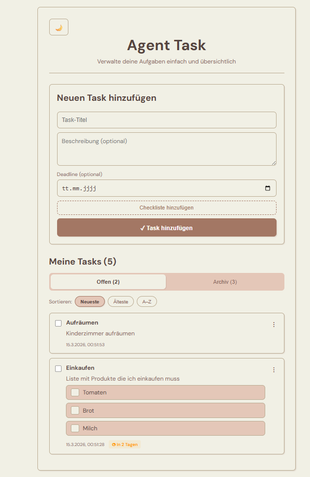

# Agent Task - Task Management App

A modern, user-friendly task management application built with React and Vite. Manage your tasks in a clean and simple interface with support for checklists, deadlines, and more.

<details>
   <summary>Show project preview</summary>



</details>

## Features

- **Task Management**: Create, edit, and delete tasks with title, description, and deadline
- **Checklists**: Add checklist items to tasks for more detailed planning
- **Status Tracking**: Mark tasks as completed or not completed
- **Dark/Light Mode**: Switch between light and dark themes
- **Responsive Design**: Optimized for desktop and mobile devices
- **Fast & Modern**: Built with Vite for excellent performance
- **Live Updates**: Real-time sync with the backend

## Tech Stack

**Frontend:**

- [React 19](https://react.dev/) - UI library
- [Vite 8](https://vitejs.dev/) - Build tool and dev server
- [Axios](https://axios-http.com/) - HTTP client
- CSS3 - Styling with CSS variables for theming

**Backend (separate):**

- [Spring Boot 3.3.5](https://spring.io/projects/spring-boot) - REST API framework
- Spring Data JPA - Database access
- PostgreSQL - Database
- Lombok - Boilerplate reduction

## Installation & Local Setup

### Prerequisites

**For the frontend:**

- Node.js (v18 or higher)
- npm or yarn

**For the backend:**

- Java 21 or higher
- Maven (or use the included Maven Wrapper)
- PostgreSQL (v12 or higher)

### Full Local Setup (Frontend + Backend)

#### 1. Install and configure PostgreSQL

1. **Download and install PostgreSQL**

   - Download: [https://www.postgresql.org/download/](https://www.postgresql.org/download/)
   - Set a superuser password during installation

2. **Create the database**

   Open PostgreSQL CLI (psql) or pgAdmin and run:

   ```sql
   CREATE DATABASE agentData;
   ```

3. **Verify database connection**

   ```bash
   psql -U postgres -d agentData
   ```

> Note: Tables are created automatically on first backend start (Hibernate DDL auto-update).

#### 2. Start the backend

1. **Clone the backend repository**

   ```bash
   git clone <backend-repository-url>
   cd agent-task
   ```

2. **Adjust database configuration** (if needed)

   Open src/main/resources/application.properties and update the values:

   ```properties
   spring.datasource.url=jdbc:postgresql://localhost:5432/agentData
   spring.datasource.username=postgres
   spring.datasource.password=your-postgresql-password
   ```

3. **Run the backend**

   ```bash
   # With Maven Wrapper (recommended)
   ./mvnw spring-boot:run

   # Or with Maven
   mvn spring-boot:run
   ```

   Backend runs at http://localhost:8080

#### 3. Start the frontend

1. **Clone the frontend repository**

   ```bash
   git clone <frontend-repository-url>
   cd agent-task
   ```

2. **Install dependencies**

   ```bash
   npm install
   ```

3. **Start the development server**

   ```bash
   npm run dev
   ```

4. **Open your browser**

   ```
   http://localhost:5173
   ```

**Done!** The full application is now running locally:

- Frontend: http://localhost:5173
- Backend API: http://localhost:8080
- PostgreSQL: localhost:5432

### Frontend-only quick setup

If backend is already running:

```bash
git clone <frontend-repository-url>
cd agent-task
npm install
npm run dev
```

## Database Schema

Database tables are created automatically by Hibernate. On first startup, the backend creates:

**Task table:**

- id (primary key)
- title (string)
- description (text)
- deadline (LocalDate)
- completed (boolean)
- timestamps (created/updated)

> Exact structure is defined by the backend JPA entities.

## API Endpoints

Frontend communicates with these backend endpoints:

```
GET    /tasks                 - Fetch all tasks
POST   /tasks                 - Create a new task
PUT    /tasks/{id}            - Update a task
DELETE /tasks/{id}            - Delete a task
PUT    /tasks/{id}/complete   - Mark task as completed
PUT    /tasks/{id}/uncomplete - Mark task as not completed
```

## Customization

### Change API URL

You can update the backend URL in src/api/tasks.js:

```javascript
const API_URL = "http://localhost:8080/tasks";
```

### Customize theme

Theme colors can be adjusted in src/theme.js.

## Scripts

```bash
npm run dev      # Start development server
npm run build    # Create production build
npm run preview  # Preview production build locally
npm run lint     # Run ESLint
```

## Contributing

Contributions are welcome. Please open a pull request or issue.

1. Fork the project
2. Create a feature branch (git checkout -b feature/AmazingFeature)
3. Commit your changes (git commit -m 'Add some AmazingFeature')
4. Push to your branch (git push origin feature/AmazingFeature)
5. Open a pull request

## License

This project is licensed under the MIT License.

## Author

Developed by Muhamed Jaber

---
